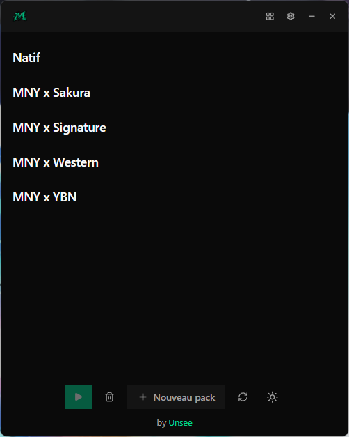
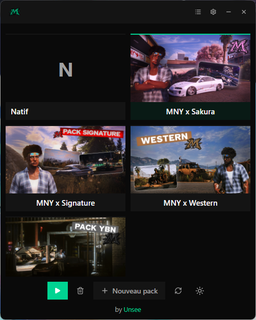
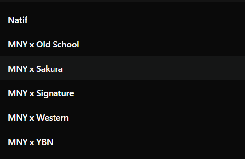
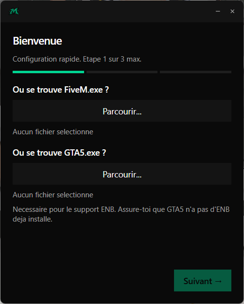
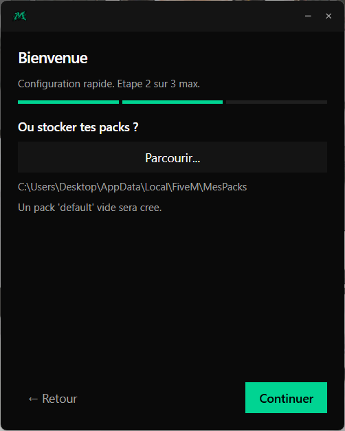
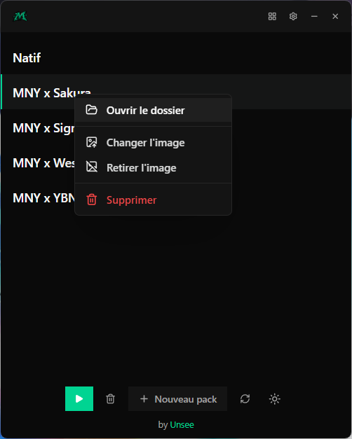
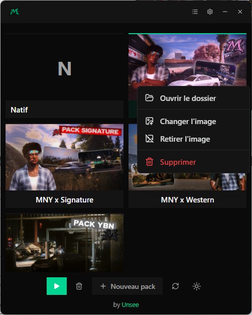
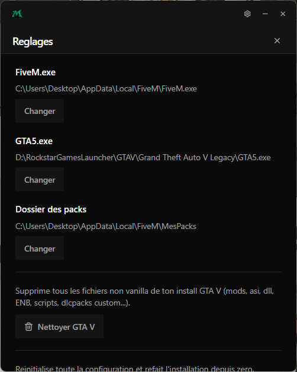

# MNY Switcher

> Outil desktop Windows pour switcher entre plusieurs packs graphiques FiveM en un double-clic.

<p align="center">
  
  
</p>

## Sommaire

- [Pourquoi](#pourquoi)
- [Fonctionnalites](#fonctionnalites)
- [Modes d'affichage](#modes-daffichage)
- [Stack technique](#stack-technique)
- [Installation](#installation)
- [Premier lancement](#premier-lancement)
- [Utilisation](#utilisation)
- [Build depuis les sources](#build-depuis-les-sources)
- [Architecture](#architecture)
- [Contribution](#contribution)
- [Licence](#licence)

## Pourquoi

Tu collectionnes plusieurs packs graphiques FiveM (mods + plugins) ? Tu veux basculer rapidement entre eux sans copier-coller des dossiers de plusieurs gigaoctets ?

MNY Switcher utilise les **junctions NTFS** de Windows : un swap de pack prend moins de 100 ms, zero copie sur le disque, sans acces administrateur.

## Fonctionnalites

- Switch instantane entre packs (< 100 ms)
- Deux modes d'affichage : liste compacte ou grille avec covers personnalisables
- Cover par pack (image d'illustration) avec actions definir / changer / retirer
- Support ENB integre
- Pack natif (sans modification) sauvegarde et restaurable
- Detection automatique du dossier FiveM
- Import du setup actuel comme premier pack
- Double confirmation pour supprimer un pack (anti-erreur)
- Nettoyage du cache FiveM en un clic
- Nettoyage des fichiers de mods orphelins de GTA V
- Theme dark / light, fenetre frameless
- Aucun acces administrateur requis

## Modes d'affichage

Bascule entre vue liste et vue grille via le bouton dans la titlebar. La vue grille met en avant les covers et le pack actif (barre laterale + fond accent).

<p align="center">
  
  
</p>

## Stack technique

| Couche          | Technologie                          |
| --------------- | ------------------------------------ |
| Frontend        | React 19 + TypeScript + Vite 7       |
| Styling         | TailwindCSS v4 (tokens semantiques)  |
| Etat            | Zustand + middleware persist         |
| Backend desktop | Tauri v2 (Rust)                      |
| Junctions       | crate `junction` 1.x (Windows NTFS)  |
| Plugins Tauri   | `opener`, `dialog`                   |

## Installation

1. Aller sur la page [Releases](https://github.com/UnseeM3/MNY-Switcher/releases)
2. Telecharger le dernier `.msi` (installeur) ou `.exe` (portable)
3. Installer ou lancer directement

> **Windows uniquement.** L'app repose sur les junctions NTFS, exclusivite Windows.

## Premier lancement

Au premier demarrage, un wizard te guide en 2 etapes :

1. **Selectionner `FiveM.exe` et `GTA5.exe`** — `GTA5.exe` sert au support ENB.
2. **Choisir le dossier de stockage** des packs (dossier central qui contiendra tous tes packs).

<p align="center">
  
  
</p>

## Utilisation

- **Switcher de pack** : double-clic sur un pack — switch + lancement de FiveM dans la foulee.
- **Creer un pack** : bouton `+` ; le dialog te guide en 4 etapes (nom, ENB ou non, contenu de depart, source).
- **Personnaliser avec une cover** : clic droit sur un pack → `Definir l'image` / `Changer l'image` / `Retirer l'image`. La cover s'affiche en vue grille.
- **Renommer / supprimer** : clic droit sur un pack pour ouvrir le menu contextuel. La suppression demande une double confirmation.
- **Reglages** : icone engrenage en haut a droite (changer `FiveM.exe`, `GTA5.exe`, dossier des packs, nettoyer cache, nettoyer GTA V, etc.).

<p align="center">
  
  
</p>

<p align="center">
  
</p>

## Build depuis les sources

Prerequis :

- [Bun](https://bun.sh) (gestionnaire de paquets utilise par ce projet)
- Rust stable (`rustup install stable`)
- Windows (les junctions NTFS sont exclusives Windows)

```bash
git clone https://github.com/UnseeM3/MNY-Switcher.git
cd MNY-Switcher
bun install
bun run tauri dev       # dev avec hot reload
bun run tauri build     # build prod (.exe + .msi dans src-tauri/target/release/)
```

Un menu interactif est aussi disponible via `switcher.bat` (Windows).

## Architecture

L'app repose sur les **junctions NTFS** de Windows. Les packs (potentiellement plusieurs gigaoctets) sont stockes dans un dossier central. Les dossiers `mods/` et `plugins/` de FiveM sont remplaces par des junctions pointant vers le pack actif.

```
[ Dossier de packs ]                [ Dossier FiveM ]

  packs/                            FiveM/
  |-- Natif/                        |-- FiveM.exe
  |   |-- mods/                     |-- mods/    --junction-->  packs/CustomA/mods/
  |   '-- plugins/                  '-- plugins/ --junction-->  packs/CustomA/plugins/
  |
  |-- CustomA/   <-- ACTIF
  |   |-- mods/
  |   |-- plugins/
  |   '-- enb/
  |
  '-- CustomB/
      |-- mods/
      '-- plugins/
```

Le swap d'un pack se decompose en :

1. Suppression des junctions `mods/` et `plugins/` du dossier FiveM
2. Recreation de ces junctions vers les dossiers du nouveau pack actif
3. (Optionnel) Installation / desinstallation de l'ENB dans le dossier GTA V

Cout total : moins de 100 ms, aucune copie de fichiers, pas besoin d'acces administrateur.

**Securite des donnees** : avant de supprimer un path existant, l'app verifie qu'il s'agit bien d'une junction. Impossible d'ecraser un vrai dossier contenant des donnees personnelles.

## Contribution

Les bugs et suggestions sont les bienvenus via les [Issues GitHub](https://github.com/UnseeM3/MNY-Switcher/issues).

Pour contribuer du code : fork + pull request. Merci de respecter les Conventional Commits en francais et de tester ton code avant de proposer la PR.

## Licence

[MIT](LICENSE) — Copyright (c) 2026 Unsee
